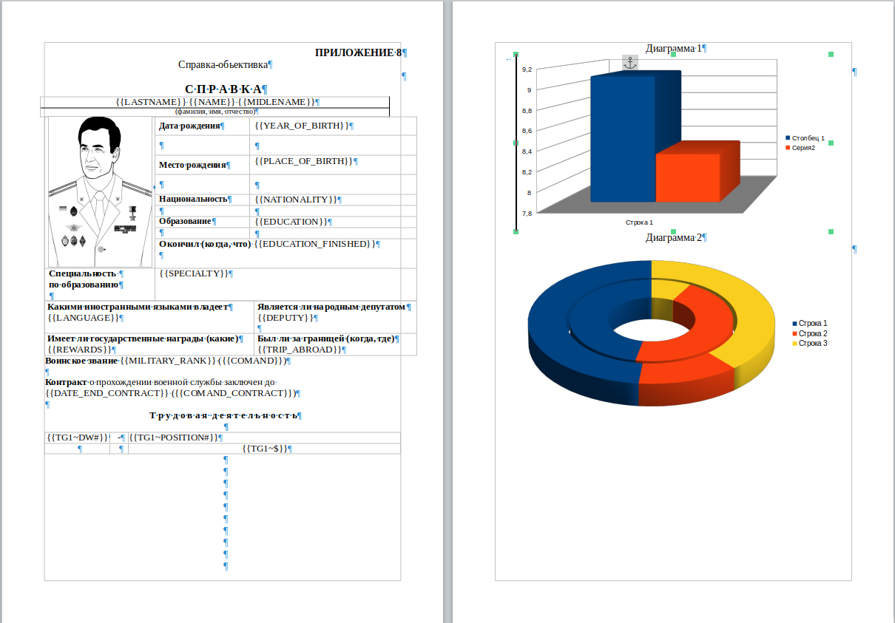
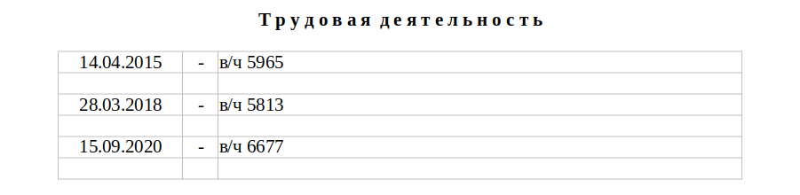
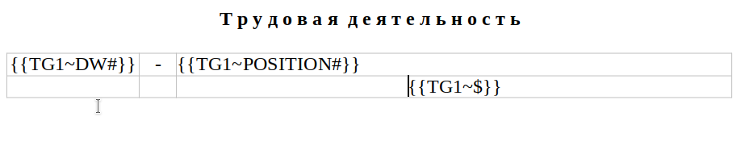
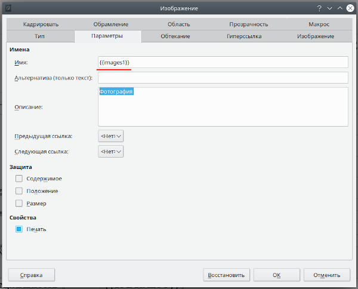
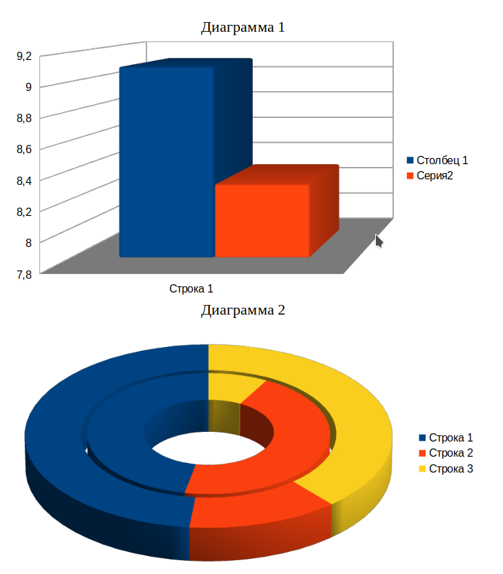
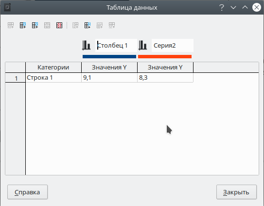

#ODTemplater
***
Пакет ODTemplater выполняет функции наполнения данными подготовленного шаблона в формате *.ODT

## Содержание
   1. [Установка](#Install)
   2. [Инициализация и работа с пакетом](#Init)
   3. [Формирование шаблона](#Template)
         * [Работа с текстом.](#Text)
         * [Работа с таблицами.](#Table)
         * [Работа с изображениями](#Img)
         * [Работа с диаграммами.](#Diagram)
   4. [Формирование входных данных](#Data)

## <a name="Install"></a> Установка пакета
***
1. Сделайте копию репозитория.
    ```shell
      git clone https://git.rosguard.gov.ru/internal/odtemplater.git
    ```
2. Перейдите в папку **`src`** проекта. Установите пакет используя **`PIP`**.
    ```shell
      cd src
      pip install odtemplater
    ```
Пакет готов к использованию!

## <a name="Init"></a> Инициализация и работа с пакетом
***
1. Импортируйте установленный пакет в свой проект.
   ```python
      from odtemplater import ODTemplater
   ```
2. Создаем экземпляр класса, и вызываем метод `create()`
   ```python
       odt = ODTemplater(data)
       out = odt.create()
   ```
   Аргумент **`data`** является словарем **`dict`**. Порядок его формирования смотрите в разделе 
   **[Формирование входных данных](#Data)**
   В выходных параметрах мы получаем массив типа **`byte`** содержащий в себе скомпилированный файл отчета в
   бинарном виде. Дальнейшее использование выходных данных может быть реализованно как хранение в базе данных, 
   так и запись файла в указанную директорию. Например:
      ```python
        with open('/out_path/file_name.odt', 'wb') as file_out:
        file_out.write(out)
      ```

## <a name="Template"></a> Формирование шаблона
***
Формирование шаблона происходит по следующим правилам.
При формировании шаблона используются `якоря` - это служебные символы или группа символов, которая при обработке будет 
заменена на текст.  <br><br>
Рассмотрим пример шаблона.<br><br>
<br><br>
В данном шаблоне рассмотрены все возможности пакета, а именно:
   * [Работа с текстом.](#Text)
   * [Работа с таблицами.](#Table)
   * [Работа с изображениями](#Img)
   * [Работа с диаграммами.](#Diagram)

### <a name="Text"></a> Работа с текстом
В местах где необходимо менять или вставлять данные, добавляются Якоря.
**`{{NAME}}`** - Где символы `{{ }}` обозначают границы якоря, а **`NAME`** - его уникальное имя. 
***<p style=" color:red">Обратите внимание, что имена якорей при последующей обработке чувствительны к регистру.</p>***
Форматирование текста применяется к якорю. 
### <a name="Table"></a> Работа с таблицами
Работа с таблицами делится на два типа:
   * Работа со статическими таблицами.
   * Работа с динамическими таблицами.
##### Статические таблицы
Статические таблицы - это таблицы, которые полностью отрисованы на этапе формирования шаблона.
В таких таблицах помещаются обычные **`якоря`** как для работы с текстом.
##### Динамические таблицы
Таблицы в которых необходимо добавлять строки в зависимости от количества входных данных.
Пример заполненной таблицы:<br><br>
<br>
Строки в таких таблицы форматируются следующим образом.<br><br>
<br>
Строки для автоматического добавляения объединяются в группу. Например в таблице выше, будет сформированна 
группа из двух строк, в которой в первой строке сформируются якоря **`{{DW1}}`**, **`{{POSITION1}}`**. А вторая строка останется пустой.
В последующих строках номер будет увеличен на единицу. 
Где в якорях типа **`{{TG1~DW#}}`**:
+ **`TG1`** - имя группы строк, оно должно быть уникально для каждой таблицы.
+ **`~`** - Разделитель имени группы от имени якоря.
+ **`DW`** - Имя якоря.
+ **`#`** - Специальный символ, который используется при необходимости добавления номерного тега.
Например тег **`{{TG1~DW#}}`** при увилечении строк на `3` будет заменен в каждой строке на **`{{DW1}}`**, **`{{DW2}}`**,
  **`{{DW3}}`**
+ **`$`** - символ для маркирования пустых строк, которые будут включены в группу. 

### <a name="Img"></a> Работа с изображениями
На место куда будет вставлено переданное изображение, в шаблоне, необходимо поставить образец, отформатировать его по размерам.
В свойствах образца указать якорь **`{{images1}}`**, если изображений несколько номер увеличить в порядке возрастания<br><br>

### <a name="Diagram"></a> Работа с диаграммами
Обработка диаграмм сводится к созданию базового шаблона диаграммы, и его дальнейшее изменение или расширение.<br><br> 
<br><br>

***<p style=" color:red">Внимание! Библиотека умеет расширять только количество строк в диаграмме.</p>***

<br><br>
В примере выше мы задаем базовую строку, с необходимым количеством ячеек. В дальнейшем передавая необходимое количество
строк во входных данных существует возможность расширять диаграмму. 
***<p style=" color:red">Важно, диаграммы нужно создавать в документе по порядку их расположения, от этого будет зависеть
порядок формирования имен во входных данных.</p>***

## <a name="Data"></a> Формирование входных данных
***
Данные для заполнения шаблона представляют собой словарь Python.
***<p style=" color: #0077b3">Формирование входных данных является важным этапом обработки шаблона. Поскольку, этот словарь имеет большую вложенность,
и требует внимательности от программиста. </p>***

Ниже будет приведен пример формирования входных данных под заполнение шаблона приведенного 
в документации в качестве образца **`./doc/Example_template.odt`**

```python
data = {'document_name': 'Myname',
        'document_template_binary': b'PK\x03\x04\x14\x00\x00\x08\x00\x00...',
        'content': {'text_and_table_content': [{'key_': 'MILITARY_RANK', 'render_text': 'лейтенант'},
                                               {'key_': 'NAME', 'render_text': 'Иван'},
                                              ],
                      'extend_set': [
                        {'key_': 'TG1', 'content': [
                            [{'key_': 'DW1', 'render_text': '14.04.2015'}, {'key_': 'POSITION1', 'render_text': 'в/ч 5965'}],
                            [{'key_': 'DW2', 'render_text': '28.03.2018'}, {'key_': 'POSITION2', 'render_text': 'в/ч 5813'}],
                            [{'key_': 'DW3', 'render_text': '15.09.2020'}, {'key_': 'POSITION3', 'render_text': 'в/ч 6677'}]
                            ]
                         }
                    ],
                    'diagram': [{'key_': 'diagram_1', 'content': [
                            {'row': 'Лейтенанты', 'cells': [{'value': '10'}, {'value': '2.3'}]},
                            {'row': 'Ст. Лейтенанты', 'cells': [{'value': '15'}, {'value': '3.3'}]},
                            {'row': 'Капитаны', 'cells': [{'value': '17'}, {'value': '1'}]},
                            {'row': 'Майоры', 'cells': [{'value': '18'}, {'value': '25'}]},
                            {'row': 'Подполковники', 'cells': [{'value': '34'}, {'value': '34'}]}
                            ]},
                                {'key_': 'diagram_2', 'content': [
                            {'row': 'Лейтенанты 1', 'cells': [{'value': '45'}, {'value': '2.3'}]},
                            {'row': 'Лейтенанты 2', 'cells': [{'value': '444'}, {'value': '2.3'}]},
                            {'row': 'Лейтенанты 3', 'cells': [{'value': '11'}, {'value': '2'}]},
                            {'row': 'Лейтенанты 4', 'cells': [{'value': '4'}, {'value': '2.3'}]},
                            {'row': 'Лейтенанты 5', 'cells': [{'value': '48'}, {'value': '7.3'}]}
                            ]}
                                ],
                    'images': [{'key_': 'images1', 'source_binary': b'PK\x03\x04\x14\x00\x00\x08\x00\x00...'},
                               {'key_': 'images2', 'source_binary': b'PK\x03\x04\x14\x00\x00\x08\x00\x00...'}]
                    }
        }
```
Словарь  **`data`** состоит из следующих подразделов
+ ##### 'document_name'
**`'document_name': 'Myname'`**, где `Myname` - имя документа.
+ ##### 'document_template_binary'
**`'document_template_binary': b'PK\x03\x04\x14\x00\x00\x08\x00\x00...'`**, для ключа `'document_template_binary'`
значением является массив **byte** получаемый путем чтения файла шаблона с ключом `'rb'`.<br> 
Пример: 
```python
    with open('./doc/Example_template.odt', 'rb') as file_in:
        data = file_in.read()
```
+ ##### 'content'
**`'content': {'text_and_table_content': [], 'extend_set': [], 'diagram': [], 'images': []}`** значением для ключа `'content'` является словарь 
содержащий в себе четыре объекта с данными для обработки текста и таблиц, расширяемых таблиц, диаграмм, и изображений.<br>
   + Ключ **`'text_and_table_content': []`** ссылается на **list** в котором перечислены значения для замещения якорей в тексте и таблицах документа.
   А именно: <br> `{'key_': 'MILITARY_RANK', 'render_text': 'лейтенант'}` где `'key_'` содержит в себе имя якоря `{{MILITARY_RANK}}`
   используемого в шаблоне, а `'render_text'` содержит текст для замещения якоря `{{MILITARY_RANK}}`.<br>
   + Опция **`extend_set`** ипользуется если в таблицах документа есть строки на расширение и заполняется по образцу:<br><br>
       ```python
        'extend_set': [
            {'key_': 'TG1', 'content': [
                [{'key_': 'DW1', 'render_text': '14.04.2015'}, {'key_': 'POSITION1', 'render_text': 'в/ч 5965'}],
                [{'key_': 'DW2', 'render_text': '28.03.2018'}, {'key_': 'POSITION2', 'render_text': 'в/ч 5813'}],
                [{'key_': 'DW3', 'render_text': '15.09.2020'}, {'key_': 'POSITION3', 'render_text': 'в/ч 6677'}]
                ]
             },
             {'key_': 'G2', 'content': [
                [{'key_': 'NUM1', 'render_text': '1518'}, {'key_': 'POSITION1', 'render_text': 'Текст 1'}],
                [{'key_': 'NUM2', 'render_text': '44598'}, {'key_': 'POSITION2', 'render_text': 'Текст 2'}],
                [{'key_': 'NUM3', 'render_text': '148425'}, {'key_': 'POSITION3', 'render_text': 'Текст 3'}]
                ]
            }
        ]
       ```
     <br>
   Где: <br>
          - **`'extend_set': []`** Содержит в себе список словарей. Каждый словарь ссылается на определенную таблицу.<br>
          - Структура словаря **`{'key_': 'TG1', 'content': []}`** - Пара `'key_': 'TG1'` является ссылкой на имя группы в таблице.<br>
          - **`'content': []`** - Содержит список строк. Пример строки: **`[{'key_': 'DW1', 'render_text': '14.04.2015'}, {'key_': 'POSITION1', 'render_text': 'в/ч 5965'}]`**. Строка в свою очередь является списком ячеек. Ячейка 
            представляет собой словарь: `{'key_': 'DW1', 'render_text': '14.04.2015'}` аналогичный словарю для обработки текстовых якорей. 
  Особое внимание стоит обратить на ключ **`'key_': 'DW1'<br>`** Он формируется исходя из тега шаблона, **`{{GR1~DW#}}`** 
  где знак # заменяется на цифру. Исходя из выше изложенного, мы формируем нужное нам количество строк во входных данных, 
  которые в последующем будут импортированы в шаблон строки.
   + **`'diagram': []`** Содержит в себе список диаграмм следующей структуры.<br>
  ```python
     'diagram': [{'key_': 'diagram_1', 'content': [
                                {'row': 'Лейтенанты', 'cells': [{'value': '10'}, {'value': '2.3'}]},
                                {'row': 'Ст. Лейтенанты', 'cells': [{'value': '15'}, {'value': '3.3'}]},
                                {'row': 'Капитаны', 'cells': [{'value': '17'}, {'value': '1'}]},
                                {'row': 'Майоры', 'cells': [{'value': '18'}, {'value': '25'}]},
                                {'row': 'Подполковники', 'cells': [{'value': '34'}, {'value': '34'}]}
                                ]},
                                    {'key_': 'diagram_2', 'content': [
                                {'row': 'Лейтенанты 1', 'cells': [{'value': '45'}, {'value': '2.3'}]},
                                {'row': 'Лейтенанты 2', 'cells': [{'value': '444'}, {'value': '2.3'}]},
                                {'row': 'Лейтенанты 3', 'cells': [{'value': '11'}, {'value': '2'}]},
                                {'row': 'Лейтенанты 4', 'cells': [{'value': '4'}, {'value': '2.3'}]},
                                {'row': 'Лейтенанты 5', 'cells': [{'value': '48'}, {'value': '7.3'}]}
                                ]}
                                    ],
  ```
<br>

Объектом диаграммы является словарь: **`'key_': 'diagram_1'`** - Где **`'diagram_1'`** - является неизменяемым именем, меняется только 
порядковый номер диаграммы по тексту, **`'diagram_1' 'diagram_2' 'diagram_3'`**. Ключ **`'content'`** возвращает список строк.
Каждая строка является словарем, содержащим **`'row': 'Лейтенанты',`** - имя строки, и список ячеек. Ячейка в свою очередь 
является так же словарем, с единственным параметром **`'value': '45'`**.
***<p style=" color: #0077b3">Приложение поддерживает возможность автоматического увеличения строк в диаграммах шаблона, для этого 
необходимо передать нужное количество входных данных. Количество ячеек должно соответствовать количеству ячеек в шаблоне.</p>***
  
   + **`'images': []`** - составляется из списка изображений, и представляет собой следующий вид: **`{'key_': 'images1', 'source_binary': b'PK\x03\x04\x14\x00\x00\x08\x00\x00...'}`** где `'key_'` содрежит маркер изображения.
   А `'source_binary'` содержит изображение в бинарном виде. Каждый пример изображения в шаблоне маркируется в свойствах якорем:<br><br> <br><br> который будет служить индикатором для замены. <br><br>

