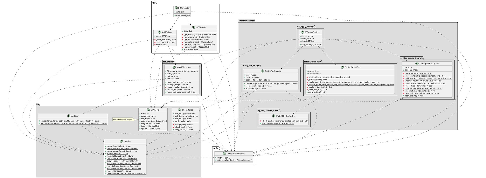

```plantuml

@startuml

package "config" {
    class ConfigurationMyOdt{
    +logger: logging
    +path_template_folder = './templates_odf/'
    }
}

package "app" {
     class ODTLoader {
    +data: dict
    -_get_extend_set_text() -> Optional[list]
    -_get_diagram() -> Optional[list]
    -_get_images() -> Optional[list]
    -_get_extend_set() -> Optional[dict]
    -_get_opt_diagram() -> Optional[dict]
    -_get_options() -> Optional[list]
    +load() -> ODTMeta
    }

    class ODTBuilder {
    +meta: ODTMeta
    -_write_template() -> str
    -_add_marker() -> None
    -build() -> str
    }

    class ODTemplater {
    +data: dict
    +create() -> bytes
    }
}

package "odt_engine" #DDDDDD {

    class MyOdfGenerator {
        +file_name_without_file_extension: str
        +path_to_file: str
        +out_path: str
        +meta: ODTMeta
        +move_and_unpack() -> None
        +settings_apply() -> None
        -_clear_template(text: str) -> str
        +render_template() -> None
        +move_and_pack_template() -> str
    }
}

package "lib" #DDDDDD {
    class Handler {
        +{static}check_slash(path: str) -> str:
        +{static}check_filename(file_name: str) -> str:
        +{static}check_format(format_file: str) -> str:
        +{static}is_exist(path: str) -> bool:
        +{static}make_folder(path: str) -> None:
        +{static}check_and_make(path: str) -> None:
        +{static}copyfile(copy_file: str, out_folder: str, \n out_name: str, out_format: str) -> None:
        +{static}movefile(copy_file: str, out_folder: str, \n out_name: str, out_format: str) -> None:
        +{static}removefile(file: str) -> None:
        +{static}renamefile(file_old: str, file_new: str) -> None:
    }

    class Archiver {
        +{static}extract_template(file_path: str, file_name: str, out_path: str) -> None:
        +{static}pack_template(path_to_pack_folder: str, out_path: str, out_name: str) -> None:
    }

    class ImageResize {
        +path_image_master: str
        +path_image_submissive: str
        +path_image_out: str
        +border_color: tuple
        -_image_size() -> None
        -_check_size() -> None
        +apply_resize() -> None
    }

   class ODTMeta {
    +name: str
    +document: bytes
    +text_replace: list
    +extend_set_text: Optional[list]
    +diagram: Optional[list]
    +images: Optional[list]
    +options: Optional[list]
    }
    note left: ODTMeta(NamedTuple)

}

package "odtapplysettings" #DDDDDD {
    package "my_odt_checker_anchor" #DDDDDD {
        class MyOdtCheckerAnchor {
        -{static}_check_anchor_list(anchor_list: list, text_xml: str) -> str
        +{static}check_anchor_bag(text_xml: str) -> str
        }
    }

    package "odt_apply_settings" #DDDDDD {
        class ODTApplySettings {
            +file_name: str
            +temp_path: str
            +date: ODTMeta
            +loop_settings() -> None
        }
    }

    package "setting_add_images" #DDDDDD {
        class SettingAddImages {
            +text_xml: str 
            +date: ODTMeta 
            +path_to_folder_template: str
            +replace_img(name_pictures: str, bin_pictures: bytes) -> None
            +loop_search_images() -> None
            +apply_setting() -> None
        }
    }

    package "setting_extend_diagram" #DDDDDD {
        class SettingExtendDiagram {
            +path: str
            +date: ODTMeta
            -{static}_parse_table(text_xml: str) -> list
            -{static}_check_data(table_option: dict, table: list) -> bool
            -{static}_add_row_and_cell(data_diagram: dict, table: list) -> list
            -{static}_insert_data(data_in: str, cell_out: str) -> str
            -{static}_insert_row_name(data_in: str, cell_in: str) -> str
            -{static}_check_first_cell(row: list) -> bool
            -{static}_loop_render(table: list, diagram: dict) -> list
            -{static}_chek_list_in_join(in_data: list) -> str
            -{static}_text_build(text_xml: str, table: str) -> str
            +apply_setting() -> None
        }
    }

    package "setting_extend_set" #DDDDDD {
        class SettingExtendSet {
            +text_xml: str
            +date: ODTMeta
            -{static}_chek_index_str_sequence(list_index: list) -> bool
            -_parsing_table() -> list
            -{static}_apply_numeric_anchor(row_table: str, group_name: str, number_replace: str) -> str
            -{static}_search_group_apply_multiplying_strings(table_string: list, group_name: str, int_multiplier: int) -> list
            -_apply_setting_table() -> list
            -_build_out_xml() -> str
            +apply_setting() -> str:
        }
    }


}

ODTLoader ..> ODTMeta
ODTLoader ..> ConfigurationMyOdt
ODTBuilder ..> ODTMeta
ODTBuilder ..> Handler
ODTBuilder ..> MyOdfGenerator
ODTBuilder ..> ConfigurationMyOdt
ODTemplater ..> ODTLoader
ODTemplater ..> ODTBuilder
ODTemplater ..> Handler 
ODTemplater ..> ConfigurationMyOdt


MyOdfGenerator ..> ConfigurationMyOdt
MyOdfGenerator ..> Handler
MyOdfGenerator ..> Archiver
MyOdfGenerator ..> ODTMeta
MyOdfGenerator ..> ODTApplySettings


Handler ..> ConfigurationMyOdt
Archiver ..> ConfigurationMyOdt
Archiver ..> Handler
ImageResize ..> ConfigurationMyOdt
ImageResize ..> Handler


ODTApplySettings ..> SettingExtendSet
ODTApplySettings ..> SettingAddImages
ODTApplySettings ..> SettingExtendDiagram
ODTApplySettings ..> ConfigurationMyOdt
ODTApplySettings ..> ODTMeta

SettingAddImages ..> ConfigurationMyOdt
SettingAddImages ..> Handler
SettingAddImages ..> ImageResize
SettingAddImages ..> ODTMeta

SettingExtendDiagram ..> ConfigurationMyOdt
SettingExtendDiagram ..> ODTMeta
SettingExtendDiagram ..> Handler

SettingExtendSet ..> ConfigurationMyOdt
SettingExtendSet ..> MyOdtCheckerAnchor
SettingExtendSet ..> ODTMeta


@enduml

```